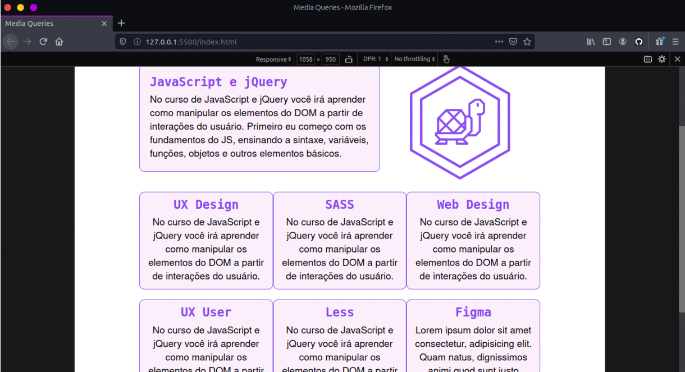

# Responsividade

## CSS Units

Unidades de medidas do CSS

Layout Fixo

`px` - Pixels

Layout Fluido

`%` - Porcentagem

`auto` - Automática

`vh` - Viewport Height

`vw` - Viewport Width

## Layoult responsivel

